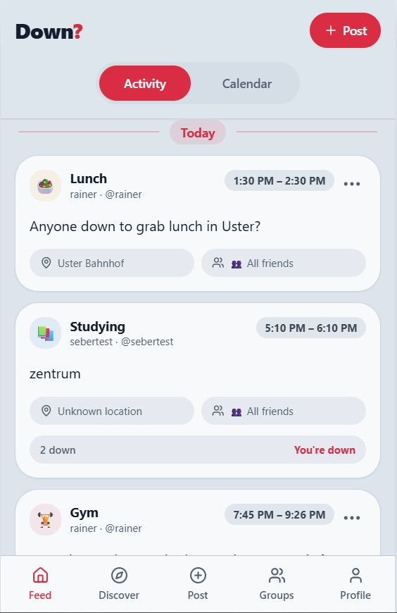
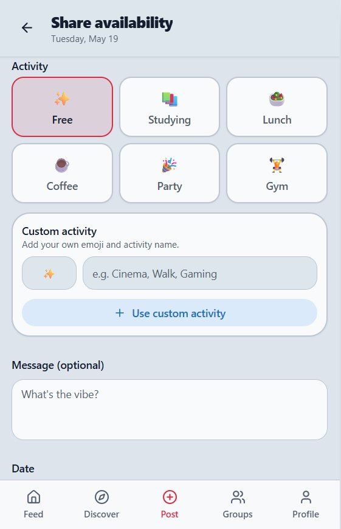
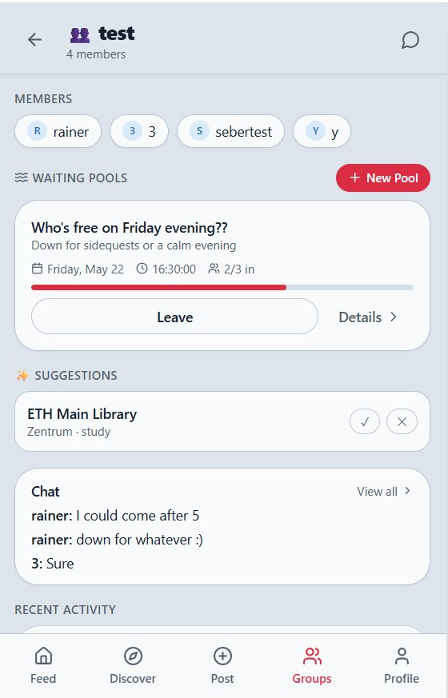
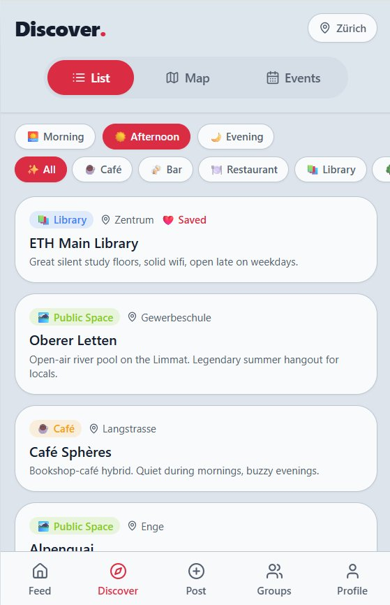
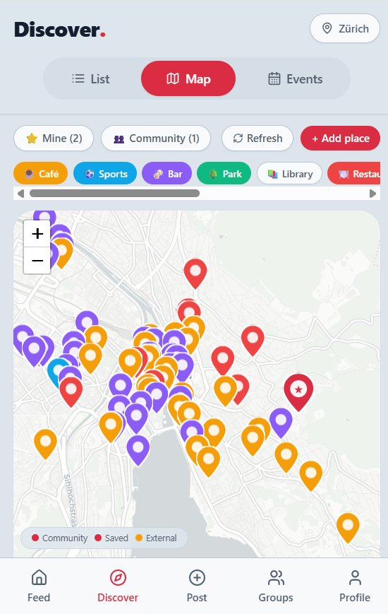
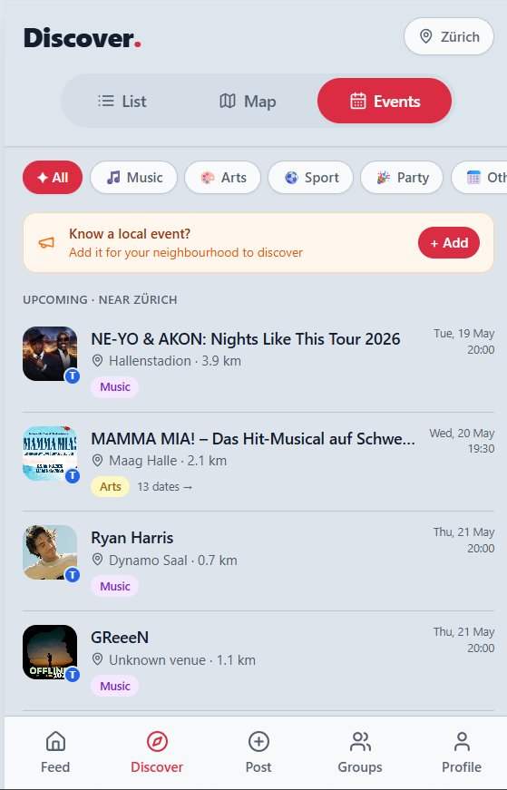
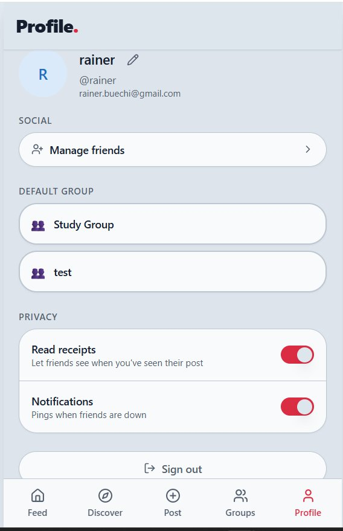

# Down? 

**See who's free. Make plans happen.**

Down? is a social availability app that makes it easy to share when you're free and spontaneously coordinate with friends. Post what you're up to, mark yourself as down for someone's plans, and discover places and events nearby — all in one place.

> Currently in active development. Running locally / invite-only.

---

## Screenshots

<table>
  <tr>
    <td align="center"><b>Feed</b></td>
    <td align="center"><b>Share Availability</b></td>
    <td align="center"><b>Groups</b></td>
  </tr>
  <tr>
    <td></td>
    <td></td>
    <td></td>
  </tr>
  <tr>
    <td align="center"><b>Discover · Places</b></td>
    <td align="center"><b>Discover · Map</b></td>
    <td align="center"><b>Discover · Events</b></td>
  </tr>
  <tr>
    <td></td>
    <td></td>
    <td></td>
  </tr>
  <tr>
    <td align="center"><b>Profile</b></td>
    <td></td>
    <td></td>
  </tr>
  <tr>
    <td></td>
    <td></td>
    <td></td>
  </tr>
</table>

---

## Features

- **Feed** — See real-time availability posts from friends. Activity type, time window, location, and audience are all visible at a glance. Mark yourself as "down" with one tap.
- **Post** — Share what you're up to with a preset activity (Lunch, Coffee, Gym, Party…) or a fully custom one. Set a time, location, and who can see it.
- **Groups** — Create groups for your circles. Use *Waiting Pools* to coordinate plans that need a quorum — the pool fills as people join, and kicks off when ready.
- **Discover · Places** — A curated list of spots in your city (currently Zürich), filterable by time of day and category. Save favourites and see what's community-recommended.
- **Discover · Map** — All places on an interactive map, colour-coded by source (community, saved, external).
- **Discover · Events** — Upcoming local events pulled in by location. Filter by type (Music, Arts, Sport, Party…).
- **Profile** — Manage friends, set a default group, and control privacy (read receipts, notifications).

---

## Tech Stack

| Layer | Technology |
|---|---|
| Framework | [React 18](https://react.dev) + [TypeScript](https://www.typescriptlang.org) |
| Build tool | [Vite](https://vitejs.dev) |
| Styling | [Tailwind CSS](https://tailwindcss.com) + [shadcn/ui](https://ui.shadcn.com) |
| Routing | [React Router v6](https://reactrouter.com) |
| Data fetching | [TanStack Query](https://tanstack.com/query) |
| Maps | [React Leaflet](https://react-leaflet.js.org) |
| Forms | [React Hook Form](https://react-hook-form.com) + [Zod](https://zod.dev) |
| Testing | [Vitest](https://vitest.dev) + [Testing Library](https://testing-library.com) |

---

## Getting Started

### Prerequisites

- Node.js ≥ 18
- [Bun](https://bun.sh) (recommended) or npm

### Install & run

```bash
# Clone the repo
git clone https://github.com/rainerbuechi/social-availability-app.git
cd social-availability-app

# Install dependencies
bun install        # or: npm install

# Start the dev server
bun run dev        # or: npm run dev
```

The app will be available at `http://localhost:8080`.

### Other commands

```bash
bun run build      # Production build
bun run preview    # Preview production build locally
bun run test       # Run tests
bun run lint       # Lint
```

---

## Project Structure

```
src/
├── components/       # Reusable UI components
│   └── ui/           # shadcn/ui primitives
├── pages/            # Top-level route pages (Feed, Discover, Groups…)
├── lib/              # API layer, types, utilities, mock data
├── hooks/            # Custom React hooks
└── test/             # Test setup
```

---

## Contributing

This is a personal project — contributions aren't open at this stage, but feel free to open an issue if you spot something.

---

## License

Private — all rights reserved.
